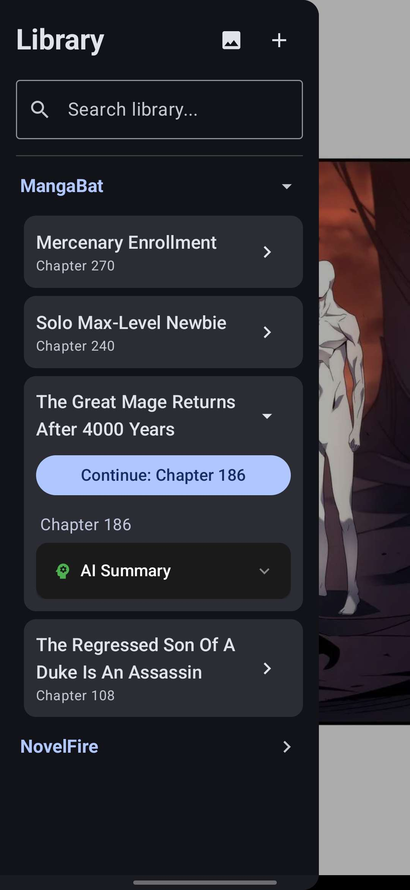

# EasyReader

[](https://www.android.com/)
[](https://kotlinlang.org/)
[](https://developer.android.com/jetpack/compose)

An Android reader for web novels, manga, manhwa, and local files (like PDFs and EPUBs). Built with Kotlin and Jetpack Compose.

<p align="center">
  
  
  
</p>

## Features

- **Built-in scraper**: Extracts text and chapters from almost any novel site.
- **Offline reading**: Pre-fetch and cache entire series locally.
- **Unified search**: Search across multiple sources (like MangaBat and NovelFire) at once.
- **Formats**: Supports web novels, manga, EPUB, PDF, and HTML.
- **Local AI**: Summarizes chapters on-device using a local LLM.
- **No cloud BS**: Everything is stored locally on your device.

## Getting Started

### Prerequisites
- JDK 17+
- Android Studio / Android SDK (compileSdk = 37)

### Run the App

1. Clone the repo:
   ```bash
   git clone https://github.com/Aatricks/EasyReader.git
   cd EasyReader
   ```

2. Run the default debug build:
   ```bash
   ./gradlew :app:installStandardDebug
   ```

## Build Variants

The app has two build flavors:
- **`standard` (default)**: Normal build. Doesn't need the local `llmedge` library. AI summarization is visible but will show as unavailable.
- **`ai`**: Enables local AI summarization and downloads the `llmedge` dependency from Maven Central automatically.
  To run:
  ```bash
  ./gradlew :app:installAiDebug
  ```

> [!NOTE]
> The app package name is still `io.aatricks.novelscraper` so existing installs don't break, but the source code namespace is `io.aatricks.easyreader`.

## Contributing

Open a PR if you want to add a source or fix a bug. 
