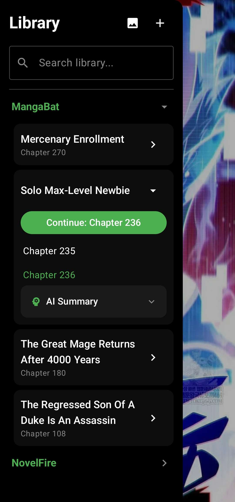
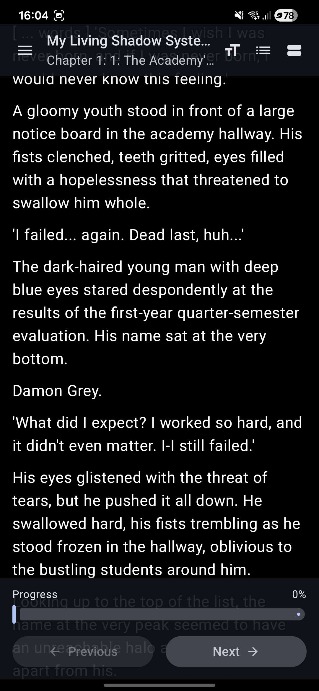
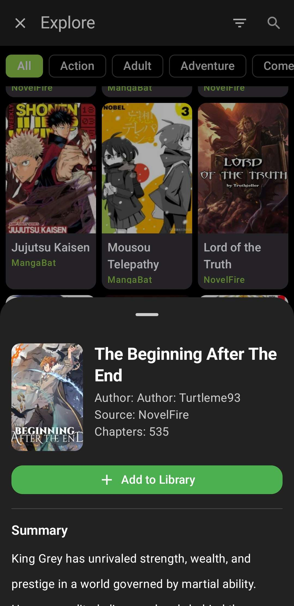

# EasyReader

[](https://www.android.com/)
[](https://kotlinlang.org/)
[](https://developer.android.com/jetpack/compose)
[](LICENSE)

**A lightweight, all-in-one Android reader for web novels, manga, manhwa, and local documents**, built with modern Kotlin and Jetpack Compose for a seamless, distraction-free reading experience.

  

---

## Overview

EasyReader is a clean, focused environment for consuming digital content. Whether you're catching up on the latest light novel chapters, reading high-resolution manga, or parsing local PDFs, EasyReader handles it all with intelligent caching, automatic progress tracking, and AI-powered insights.

**Why EasyReader?**
- **Discovery Hub**: Integrated exploration of popular sources like MangaBat and NovelFire.
- **Smart Scraping**: "Smart Scraper" engine that extracts content from almost any online novel.
- **Offline-first**: Pre-fetch and cache entire series for uninterrupted reading anywhere.
- **Distraction-free**: Immersive Material3 design with edge-to-edge display and dark theme.
- **AI-powered**: On-device LLM integration for instant chapter summaries.

---

## Features

### **Content Discovery**
- **Unified Explore**: Browse popular titles or search across multiple novel and manga sources simultaneously.
- **Extensible Sources**: Native support for major platforms with a generic fallback for unknown sites.
- **Detailed Previews**: View summaries, author info, and chapter lists before adding to your library.

### **Multi-Format Reading**
- **Web Novels**: Clean, text-focused reading.
- **Manga & Manhwa**: High-performance image rendering.
- **Local Documents**: Support for PDF, EPUB, and HTML files with automatic formatting.
- **Deep Link Support**: Add content directly by pasting a URL into the app.

### **Reading Experience**
- **Immersive UI**: Full-screen, edge-to-edge display with Material3 dynamic colors.
- **Smart Navigation**: Fluid swipe gestures to navigate chapters and auto-restore scroll position.
- **Intelligent Formatting**: Automatic removal of page numbers, ads, and HTML noise.

### Build Variants

The app uses product flavors to make AI summarization optional:

- **standard (default)**: Clean-clone debug builds do not require the `llmedge` library. AI summarization UI is visible but reports "unavailable".
- **ai**: Enables on-device AI summarization and downloads `llmedge` automatically from Maven Central when you build the AI variant.

For day-to-day development, use the default debug path below. If you want the AI-enabled flavor, build the `aiDebug` variant in Android Studio or with Gradle.

### **Library & Management**
- **Cloud-free Caching**: Store everything locally for privacy and speed.
- **Progress Tracking**: Visual indicators and "Currently Reading" markers for every item.
- **Batch Operations**: Easily manage your collection with multi-select delete and bulk updates.

---

## Installation

### Prerequisites
- **JDK 17+**
- **Android Studio** with the Android SDK installed
- **Android SDK Platform 36** to match `compileSdk = 36`

### Quick Start

**1. Clone the repository**
```bash
git clone https://github.com/Aatricks/EasyReader.git
cd EasyReader
```

**2. Build and run**

Start with the default debug workflow. These commands do not require release signing material or any local AAR setup, and they validate the default `standardDebug` variant used for PRs:

```bash
./gradlew :app:assembleStandardDebug
./gradlew :app:installStandardDebug
./gradlew :app:testStandardDebugUnitTest
./gradlew :app:lintStandardDebug
```

Open the project in Android Studio, sync Gradle, and run the default debug variant if you prefer the IDE.

For CI-style flavor coverage, PR validation uses only `:app:lintStandardDebug`, `:app:testStandardDebugUnitTest`, and `:app:assembleStandardDebug`.

### Release Signing

Release builds are separate from the normal debug workflow.

The app keeps the legacy `io.aatricks.novelscraper` application ID on purpose so existing installs can continue updating in place. The source namespace has moved to `io.aatricks.easyreader` to match the EasyReader name.

If you need a release build, create a local `keystore.properties` file at the repository root with these keys:

- `storeFile`
- `storePassword`
- `keyAlias`
- `keyPassword`

The `storeFile` value should point to your local keystore file. Do **not** commit `keystore.properties` or the keystore itself; keep them private and machine-local.

### Optional AI Setup

AI summarization is optional and does not affect the default debug path.

To build the AI-enabled flavor, use the explicit `aiDebug` tasks. These are optional and require the AI dependency path to resolve:

```bash
./gradlew :app:assembleAiDebug
./gradlew :app:testAiDebugUnitTest
./gradlew :app:lintAiDebug
```

Or select the `aiDebug` build variant in Android Studio. Gradle will download `llmedge` from Maven Central automatically; no local AI AAR is required.

---

## Support

If you find EasyReader useful, please consider:
- **Starring** the repository
- **Contributing** with new sources or feature enhancements
